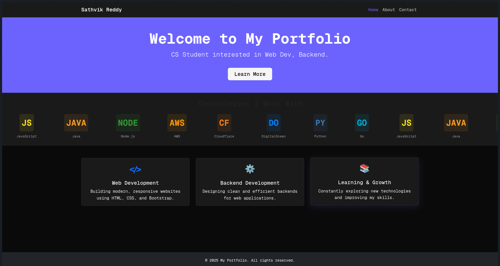

## approch
- read through requirements
- used custom css to make website look much more minimal and nice

## templating engine
**nunjucks** was used as the templating engine.
**reason:** it felt familiar to some of the previous templating engines i used (gotmpl)

## bundler
i used **vite** since it was a familiar tool for me

## issues
i had issues integrating icons from fontawesome. currently working to fix it

## screenshots


# Setting up Project
1. Clone the repo
```
git clone https://github.com/simmuuu/keshavsoft-assign-2.git
cd keshavsoft-assign-2
```

2. Install dependencies
```
pnpm install
```

3. Build
```
pnpm build
```

4. Development server:
```
pnpm dev
```